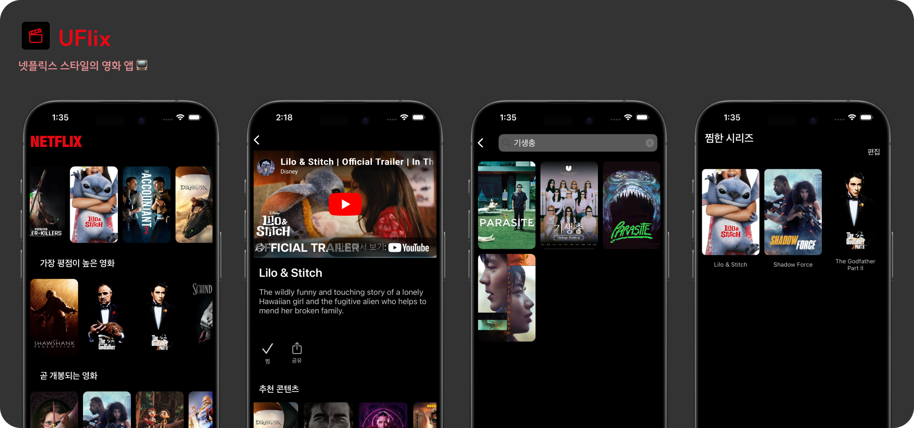
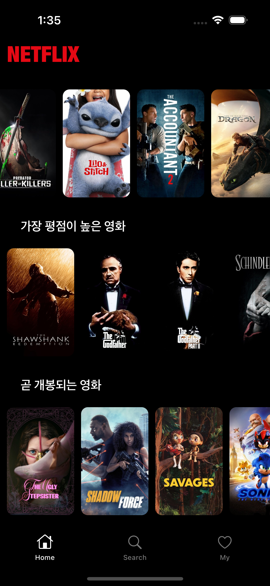
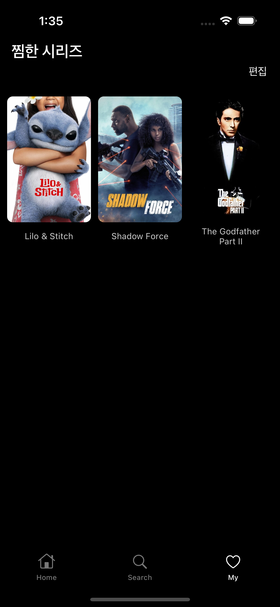

# Uflix 🎬  

TMDB API를 활용한 넷플릭스 스타일 iOS 영화 앱 🍿🎬  
RxSwift & MVVM 아키텍처 기반으로 제작된 개인 프로젝트입니다.  

 <!-- 배너 이미지 있으면 삽입 -->

<br> 

---

## 📱 주요 기능

### 🏠 홈 화면
- 인기 영화, 최고 평점 영화, 개봉 예정 영화 섹션 구성
- Compositional Layout + 수평 스크롤
- 셀 클릭 시 상세 화면으로 이동

### 🔍 검색
- 검색어 입력 시 추천 키워드 표시
- 검색 이력 저장 및 최대 10개까지 유지
- 검색 결과 없음 처리
- 검색창 클릭 시 이전 화면 복귀 기능

### 🎞️ 상세 화면
- 영화 이미지, 설명 표시
- AVPlayerViewController 사용한 영상 재생 기능
- 관련 추천 콘텐츠 가로 스크롤
- 찜 추가 버튼 (CoreData 저장)

### ❤️ 마이 페이지 (찜한 목록)
- 찜한 영화 리스트 표시
- 편집 모드 전환 및 다중 선택 삭제
- CoreData 기반 로컬 저장소 관리

<br> 

---

## 🧱 기술 스택

| Category | Stack |
|------|------|
| Language | `Swift` |
| UI Framework | `UIKit` + `SnapKit` |
| Architecture | `MVVM` |
| Reactive Programming | `RxSwift`, `RxCocoa` |
| Local Storage | `CoreData` |
| Networking | `URLSession` + `TMDB API` |
| Image Caching | `Kingfisher` |
| Video | `AVKit`, `AVPlayerViewController` |

<br> 

---

## 🗂️ 프로젝트 구조

```bash
Uflix/
├── App/                # 앱 기본 설정 및 Info
├── Common/             # 네트워크, CoreData 등 공통 유틸
├── Model/              # Movie, Video, FavoriteMovie 등 모델
├── Base/               # 공통 ViewController, TabBar 등
├── Scene/
│   ├── Main/           # 홈 화면
│   ├── Detail/         # 영화 상세 화면
│   ├── Search/         # 검색 화면
│   └── MyNetflix/      # 찜한 영화 목록
├── Config/             # 설정 관련 파일
└── README.md
```

<br> 

---

## 🚀 실행 방법

1. 이 저장소를 클론합니다.

```bash
bash
코드 복사
git clone https://github.com/your-username/Uflix.git

```

1. `TMDB_API_KEY`를 설정합니다.

`Info.plist`에 다음 키를 추가해 주세요:

```xml
xml
코드 복사
<key>TMDB_API_KEY</key>
<string>YOUR_TMDB_API_KEY</string>

```

1. 라이브러리 설치 (RxSwift 등은 CocoaPods 또는 Swift Package Manager로 설치되어야 합니다)


<br> 

---

## 📸 UI 스크린샷

| 홈 화면 | 상세 화면 | 검색 | 찜한 목록 |
|:--:|:--:|:--:|:--:|
|  |  |  |  |


<br> 

---

## 👩🏻‍💻 개발자

- 정유진 ([@github](https://github.com/yyujnn))  


<br> 

## 🔗 API

- [TMDB Developers](https://developer.themoviedb.org/docs)


<br> 
